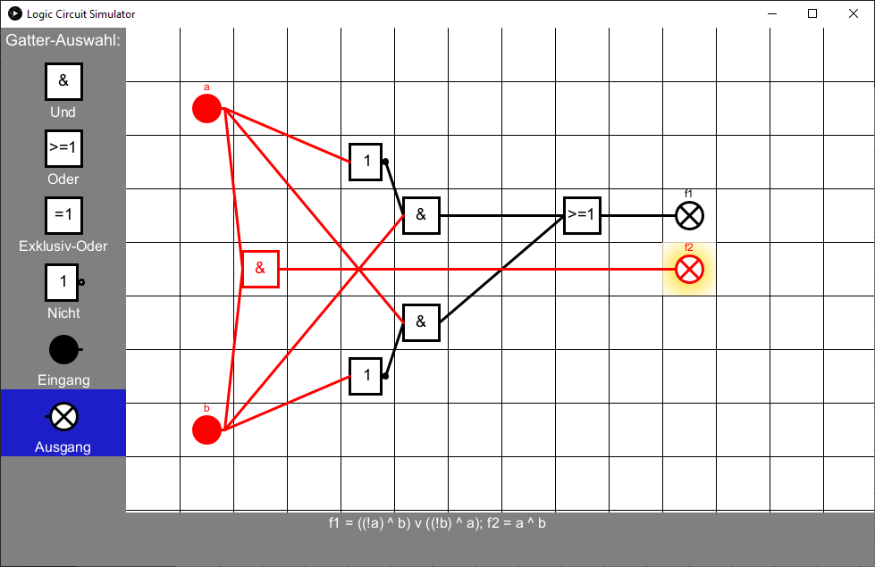

# Logic Circuit Simulator

Bei dieser Java-Anwendung handelt es sich um eine Simulation zum Entwurf und zur Visualisierung von logischen Schaltungen. Die Benutzeroberfläche wurde mit [Processing](https://processing.org/) umgesetzt.

Logische Schaltungen bestehen aus Logikgattern, die mehrere Eingänge und einen Ausgang besitzen. Logikgatter arbeiten nur mit Wahrheitswerten (wahr/falsch bzw. 1/0).
Je nach Gatter werden diese Eingangswerte unterschiedlich miteinander verknüpft.
Das Programm bietet die drei Grundgatter an:

* Und (Der Ausgang ist wahr, wenn alle Eingänge wahr sind.)
* Oder (Der Ausgang ist wahr, wenn mindestens einer der Eingänge wahr ist.)
* Nicht (Der Ausgang liefert das Gegenteil des Eingangswerts.)

Und-/Oder-Gatter können beliebig viele Eingänge besitzen, Nicht-Gatter nur einen.

Mit diesen drei Grundgattern lassen sich auch komplexe Schaltungen, wie z. B. ein Addierer für Binärzahlen, realisieren.
Zusätzlich gibt es Ein- und Ausgangsgatter, die anschaulich durch Schalter und Lampen dargestellt werden und mit denen die Schaltung getestet werden kann.
Das Exklusiv-Oder-Gatter ähnelt dem Oder-Gatter, hier ist der Ausgang allerdings nur wahr, wenn genau ein Eingang wahr ist.

Die aufgebauten Schaltungen werden zusätzlich in einer Textschreibweise als sog. boolesche Funktionen angezeigt.

## Bedienung

Auf der linken Seite des Fensters kann man per Mausklick auswählen, welche Art von Logikgattern man aktuell verwenden will. Die ausgewählte Gatter-Art wird blau hervorgehoben. Alternativ kann man die Gatter auch mit den Tasten 1 bis 5 auswählen (dabei wählt "1" das Und-Gatter aus, "2" das Oder-Gatter usw.).

Im Gitter rechts daneben werden dann die Gatter platziert, wobei sich in jedem Kästchen nur ein Gatter befinden kann. Zum Hinzufügen eines neuen Gatters klickt man mit der linken Maustaste auf ein leeres Feld. Die Auswahl aus dem letzten Abschnitt bestimmt dabei, welche Art von Gatter platziert wird.

Klickt man mit der linken Maustaste auf ein besetztes Feld, wird das Gatter in diesem Feld ausgewählt und blau hervorgehoben. Klickt man auf ein schon ausgewähltes Gatter, wird die Auswahl wieder aufgehoben.

Hat man ein Gatter ausgewählt, stehen zusätzliche Aktionen zur Verfügung: Klickt man jetzt mit der rechten Maustaste auf ein anderes Gatter, wird dieses Gatter mit dem ausgewählten Gatter verbunden (dargestellt durch eine Linie). Drückt man die Taste R, wird das ausgewählte Gatter und alle Verbindungen zu diesem entfernt.

Bei dieser Simulation sind nicht alle möglichen Verbindungen zwischen Gattern erlaubt: ein Gatter kann nicht (auch nicht über andere Gatter) mit sich selbst verbunden werden, da sonst die Darstellung als boolesche Funktion nicht möglich wäre.
Daher lassen sich z. B. Flip-Flop-Speicherelemente nicht umsetzen. Versucht man, solche Verbindungen herzustellen, wird eine Fehlermeldung angezeigt.

Eingangs-Gatter stellen hier einen Sonderfall dar: Hier ändert ein Rechtsklick den Ausgangswert von falsch zu wahr bzw. von wahr zu falsch. Gatter oder Verbindungen, die den Zustand "wahr" haben, werden rot dargestellt, Ausgangsgatter mit dem Zustand "wahr" werden zusätzlich durch einen gelben Leuchteffekt veranschaulicht.

Die Größe des Programmfensters kann beliebig verändert werden, falls der Platz für die Schaltung nicht mehr ausreicht. Ist dann immer noch nicht genug Platz vorhanden, kann die Schaltung über die Pfeiltasten in alle Richtungen verschoben werden. Diese Verschiebung kann man durch Drücken der Taste "M" zurücksetzen.

Drückt man die Taste C, wird die gesamte aufgebaute Schaltung gelöscht.

Die Darstellung als boolesche Funktionen am unteren Rand des Fensters wird automatisch aus der aufgebauten Schaltungen erzeugt, zu jedem Ausgangsgatter gehört eine boolesche Funktion.
Damit diese Darstellung funktioniert, bekommt jedes Ein- und Ausgangsgatter einen Namen, der in der Schaltung über dem Gatter angezeigt wird.
In der hier verwendeten booleschen Schreibweise steht "^" für "Und", "v" für "Oder", "!" für "Nicht" und "XOR" für "Exklusiv-Oder".

## Verwendete Bibliotheken

* [Processing](https://processing.org/)
* [JUnit 4](https://junit.org/junit4/)
